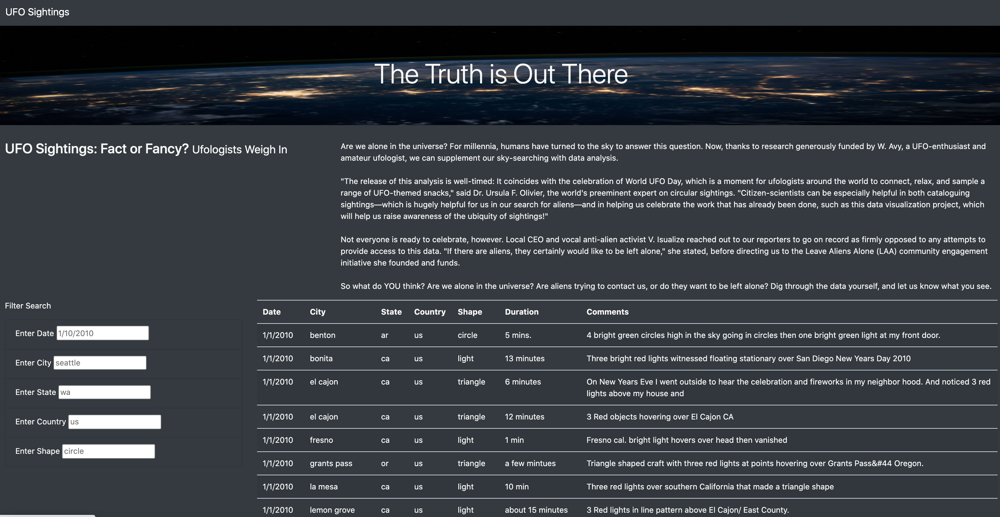

# UFOs Analysis

## Overview

The purpose of this project is to compile data from different UFO encounters around the US and present them on one easy to use webpage.

This webpage is created through JavaScript, html, and css.

## Results

Here is an image of the webpage.

On the webpage you can scroll through the table to see all of the different UFO sightings or you can use the filters on the left side. These filters allow you to filter the table by the date, city, state, country, or shape of UFO seen.

## Summary

This webpage does give a great overview of UFO sightings in the US, but it does have a few shortcomings. The biggest one is that does not have the functionality to add live data as it comes in. The data that is a part of the data file will stay the same unless someone manually goes in and updates it.

### Recommendations

Additional filters could be added, although the coding would be more intensive, to search for incomplete matches within the comments field, and another filter for duration. For the duration you'd want to convert this column into a universal time space (probably measured in seconds of duration), so the code could block off and better understand those durations.

Another suggestion is simply getting more data into the program; while the data provided is interesting, it is limited in date range and completeness. The prospective searcher may be looking in places or for dates that are not well represented in the data set.

